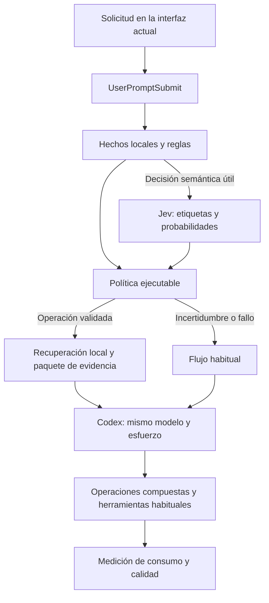

# Especificación: decisiones automáticas para reducir tokens en Codex

Repository update (2026-10-02): `codex-token-efficiency/` is an independent Git repository with its authorized delivery remote and `develop` branch. Phases 0–1 merged; phase 2 is implemented and reviewed in PR #3, with final documentation/checks preceding merge. Paths below are relative to its root; the former parent repository's Git metadata was moved to Trash. This approved design remains the target; [usage](usage.md) and [phase validation](validation/phase-2.md) describe actual current capabilities and limits.

## 1. Decisión y objetivo

Construir una automatización pequeña, independiente de LifeOS: hooks nativos de Codex, un programa local con operaciones conocidas y Jev para decisiones semánticas acotadas. Mantener la interfaz actual, según la preferencia confirmada por Roe.

El objetivo es reducir tokens y tiempo por tarea terminada correctamente, trasladando decisiones repetitivas fuera del modelo conversacional. El piloto conserva su modelo y esfuerzo; así podremos distinguir el ahorro por contexto y operaciones del efecto de cambiar de modelo.

This approved specification records the brainstorming design. The [initial research](codex-token-efficiency-proposal.md) contains source analysis. This document supersedes its implementation-location, phase-order and Jev-timing decisions. Implementation is in progress; limited native integration has been measured, but no family is promoted and no general token saving is claimed.

Todo el código, pruebas y documentación del proyecto se mantiene en `codex-token-efficiency/`. El [AGENTS.md del módulo](../AGENTS.md) fija el proceso obligatorio de planificación, implementación y entrega.

### Alternativas consideradas

| Alternativa | Ventaja | Límite | Decisión |
|---|---|---|---|
| Solo reglas y hooks | Menor coste; hechos y secuencias conocidas resueltos localmente. | Continuidad del objetivo y relevancia semántica quedan sin resolver o recaen en el LLM. | Referencia experimental y comportamiento de reserva. |
| Reglas, operaciones locales y Jev | Automatiza preparación de contexto y elecciones acotadas; conserva la interfaz. | Requiere calibración; la cobertura depende de los hooks del cliente real. | Recomendada. |
| Cliente propio sobre App Server | Control anterior al turno, incluyendo modelo y esfuerzo. | Más mantenimiento y cambio de interfaz. | Fuera del piloto elegido. |

La inspiración de Glance es formular preguntas pequeñas y dejar la acción en código. No copiar sus dieciocho preguntas, clasificadores entrenados ni su arquitectura de despacho. También se incorporan selección progresiva de evidencia, operaciones compuestas y deduplicación con invalidación explícita.

## 2. Alcance y requisitos

| ID | Requisito verificable |
|---|---|
| R1 | Funcionar en la interfaz actual; verificar que sus hooks se ejecutan realmente antes de activar cambios. |
| R2 | Ejecutar la preparación seleccionada automáticamente, sin pedir al LLM que decida si invocar la skill de ahorro. |
| R3 | Resolver hechos con código y consultar Jev solo para una decisión semántica con una acción concreta disponible. |
| R4 | Reducir búsquedas intermedias, lecturas repetidas y resultados redundantes; medir el consumo total por resultado correcto. |
| R5 | Preservar instrucciones, permisos, evidencia requerida, solicitudes exhaustivas y posibilidad de ampliar contexto. |
| R6 | Ante incertidumbre o fallo del optimizador, conservar el flujo habitual; los errores de la herramienta original siguen visibles. |
| R7 | Mantener trazabilidad de decisiones, versiones, contexto entregado, ampliaciones y consumo observado. |
| R8 | Activar cada operación por separado, con evidencia de ahorro y calidad; poder desactivarla sin reinstalar Codex. |

El piloto cubre repositorios locales, preparación de revisiones y análisis de código, documentación relacionada, búsquedas y verificaciones conocidas. No modifica el razonamiento sustantivo, la solución de bugs, la arquitectura propuesta por el LLM ni las comprobaciones exigidas por el proyecto.

Quedan fuera: un router universal de shell, reescritura arbitraria de MCP, generación de planes por Jev, nueva base vectorial, resúmenes de cada lectura mediante IA, entrenamiento de clasificadores y cambio automático del modelo principal. Tampoco se presupone que un hook local controle herramientas alojadas o ejecución cloud remota.

## 3. Qué decide cada componente

| Decisión | Responsable | Motivo |
|---|---|---|
| Archivos existentes, cambios, símbolos literales y comandos disponibles | Programa local | Son hechos comprobables. |
| Permisos, rutas permitidas, límites e invalidación de caché | Programa local y controles nativos | No dependen de probabilidades. |
| Continuidad de una petición y familia de contexto pertinente | Jev, cuando faltan reglas concluyentes | Clasificación semántica acotada. |
| Relevancia entre candidatos ya identificados | Ranking local; Jev solo si mejora el resultado medido | Jev no inventa rutas ni consultas. |
| Qué utilidades forman una operación conocida y en qué orden | Programa local | Evita decisiones y resultados intermedios del LLM. |
| Interpretación del código, diagnóstico, cambios y justificación | Modelo principal | Requieren juicio abierto y evidencia. |
| Si hace falta más evidencia para resolver el problema | Modelo o una condición objetiva del selector | La ampliación permanece disponible y no necesita permiso de Jev. |

Ejemplo: ante una revisión con archivos concretos, el programa obtiene cambios, referencias y pruebas relacionadas en una secuencia. Jev puede escoger la familia `code_review_context` cuando la petición es ambigua. El LLM recibe evidencia y realiza la revisión, sin decidir por separado cada búsqueda inicial.

Jev sigue siendo inferencia probabilística externa. La mejora perseguida es sustituir decisiones conversacionales caras por clasificación acotada y ejecución local, contabilizando también el coste de esa clasificación.

## 4. Arquitectura mínima y flujo

La implementación propuesta reside en `src/codex-context-policy.mjs`, dentro de este módulo y fuera del payload de LifeOS. Usar Node ya instalado, su biblioteca estándar, `git`, `rg` y RTK. Desarrollar con TDD, empezando por pruebas de comportamiento y la implementación mínima que las satisface; dividir únicamente si el tamaño o las responsabilidades lo requieren. Sin dependencias nuevas ni proceso residente.

Integración: hooks registrados por proyecto, estado local por sesión y una skill breve con los contratos de las operaciones y la forma de ampliar evidencia. La skill facilita su uso; la preparación previa no depende de su selección por el LLM.

### Despliegue y desactivación

El piloto registra sus entradas en `<repo>/.codex/hooks.json`. Codex admite esa ubicación y la global `~/.codex/hooks.json`; usar el alcance de proyecto para el piloto. Fuente: [Ubicaciones de hooks de Codex](https://learn.chatgpt.com/docs/hooks).

| Pieza | Ubicación propuesta | Función |
|---|---|---|
| Programa y reglas | `src/codex-context-policy.mjs` | Código local del módulo; no requiere un servidor propio. |
| Registro de hooks | `<repo>/.codex/hooks.json` | Conecta ese proyecto con el programa; conserva otras entradas existentes. |
| Interruptores | `<repo>/.codex/codex-context-policy.json` | Control de modo y consultas a Jev, sin credenciales. |
| Estado y telemetría | `~/.codex/codex-context-policy/`, separados por repositorio y sesión | Caché, decisiones y medición locales; fuera del árbol del proyecto. |
| Clasificación Jev | API de TypeSafe | Servicio externo consultado únicamente cuando corresponde y está habilitado. |

Original minimal configuration shape; the installed implementation and extended family settings are documented in [usage](usage.md):

```json
{
  "mode": "off",
  "jev_enabled": true
}
```

- `off`: el programa termina sin consultar Jev, preparar contexto ni reescribir herramientas. El registro del hook puede permanecer; conserva el pequeño coste local de arrancar y comprobar el modo.
- `shadow`: calcula y registra sin aplicar decisiones. Si `jev_enabled` es `true`, puede consultar Jev y consumir su cuota, aunque no cambie el contexto de Codex.
- `enforce`: aplica únicamente operaciones promovidas. Con `jev_enabled: false`, conserva las reglas y operaciones deterministas, sin consultas ni decisiones almacenadas de Jev; las decisiones semánticas sin resolver vuelven al flujo habitual.

Leer la configuración en cada invocación; si falta o es inválida, usar `off`. Cambiar a `off` afecta a las llamadas siguientes, sin relanzar la interfaz. No cancela una consulta ya enviada ni elimina evidencia añadida previamente a la conversación. Para comparar con una conversación sin esa evidencia, iniciar una nueva.

La instalación deja `off`; la fase 1 activa `shadow` solo en el proyecto piloto. Los demás proyectos conservan su funcionamiento porque no registran estos hooks. Una instalación global quedaría fuera del piloto y requeriría habilitar explícitamente sus proyectos.

Para retirar la integración por completo, quitar sus entradas del registro y retirar su skill si se instaló. Conservar los demás hooks y programas del usuario. Cambiar el interruptor no necesita editar las definiciones de hooks ni desactivar comprobaciones ajenas a este piloto.

Las plantillas de instalación y documentación permanecen dentro del módulo. Solo el registro nativo del cliente, los interruptores de instalación, las credenciales y el estado operativo usan sus ubicaciones externas. No mantener otra copia del código en `agent-scripts`. Antes de retirar un worktree, comprobar que no queden hooks instalados apuntando a él.



Orden de cada solicitud:

1. Identificar sesión, turno, raíz real del repositorio y cambios desde la preparación anterior.
2. Reconocer hechos concluyentes: rutas explícitas, símbolos literales, petición de exhaustividad y operaciones conocidas. No clasificar dificultad por longitud del mensaje.
3. Si queda una decisión útil y el estado cabe en el presupuesto, consultar Jev. En modo `shadow`, registrar la decisión sin alterar el flujo habitual.
4. Aplicar reglas: conservar evidencia protegida, validar candidatos y escoger una receta existente. Jev nunca proporciona un comando ejecutable.
5. En modo `enforce`, ejecutar únicamente preparación de lectura y entregar un paquete acotado antes de la generación. En `shadow`, guardar su propuesta local sin inyectarla al modelo.
6. Durante el turno, las operaciones locales agrupan pasos y ofrecen ampliación. Registrar cambios, errores y consumo; invalidar contexto obsoleto.

La preparación automática de lectura no ejecuta pruebas, instala paquetes ni modifica archivos del proyecto. Las verificaciones se ejecutan después, dentro de la llamada y los permisos habituales de Codex.

### Límites del contrato nativo

`UserPromptSubmit` permite añadir contexto, no cambiar modelo o esfuerzo. `PreToolUse` puede reescribir argumentos de llamadas locales; no cambia su nombre. Las herramientas alojadas quedan fuera. `PostToolUse` no ofrece reemplazo genérico soportado del resultado: la reducción ocurre en su productor. Fuente: [Hooks de Codex](https://learn.chatgpt.com/docs/hooks).

Un hook previo a una herramienta llega después de su elección por el LLM. Su utilidad es reducir pasos posteriores; el ahorro de la elección inicial procede de preparar contexto antes del turno o agrupar operaciones.

La fase de compatibilidad probará el cliente real, llamadas anidadas y comandos persistentes. No basta comprobar que la CLI admite hooks. Si falta un evento requerido, se desactiva esa operación en ese cliente; no se sustituye la interfaz elegida.

## 5. Estado y contratos de datos

Son objetos JSON internos del programa, no una nueva API pública ni un framework de políticas.

| Objeto | Campos mínimos | Uso |
|---|---|---|
| `TaskState` | `session_id`, `turn_id`, `request_hash`, solicitudes explícitas recientes, `repo_root`, `repo_revision`, `context_epoch` | Identificar la tarea y su evidencia vigente. |
| `DecisionRecord` | `decision_id`, `operation`, `source`, `action`, candidatos elegidos, versiones, probabilidades, `fallback_reason`, duración | Explicar y reproducir cada decisión. |
| `ContextBundle` | solicitud y revisión asociadas, rutas relativas, líneas, contenido exacto, hashes, `coverage_status`, omisiones, forma de ampliación | Entregar evidencia comprobable. |

`source` admite `rule`, `jev` o `cache`. `action` admite `baseline`, `prefetch` o `reuse`. `coverage_status` distingue `partial` y `complete`; un paquete inicial parcial nunca implica que la revisión solicitada esté completa.

El estado guarda texto explícito reciente; no genera un resumen con otro LLM ni permite que Jev elimine restricciones anteriores. Una respuesta corta como «hazlo» conserva el objetivo si su continuidad se conoce; si no, evita la optimización semántica. La conversación del modelo sigue siendo la referencia del trabajo.

La revisión del repositorio incluye `HEAD` y hashes de entradas relevantes modificadas, también archivos sin seguimiento cuando formen parte de la tarea. Para buscar candidatos nuevos, refrescar el inventario por turno: `HEAD` por sí solo no identifica el estado de trabajo.

Guardar estado por sesión con reemplazo atómico y registros de decisiones independientes. Aislar sesiones y repositorios; no usar un único JSON compartido con contadores modificados por varios procesos. Ante conflicto o estado corrupto, perder una oportunidad de ahorro y continuar con el flujo habitual.

La caché requiere solicitud, estado de tarea, corpus, permisos, modelo real de Jev, versión de preguntas y política. No reutilizar una decisión solo porque coinciden las palabras del prompt.

## 6. Contrato de Jev

Usar `https://api.typesafe.ai`: descubrir modelos mediante `GET /v1/models` y consultar `POST /v1/systemone`, con credenciales fuera del repositorio. El contrato acepta `model`, `state` y `questions`; devuelve `answers`, el modelo ejecutado y `usage`. Una pregunta `noul` devuelve una probabilidad; una `choice`, etiqueta y distribución. Fuente: [OpenAPI oficial de TypeSafe](https://api.typesafe.ai/openapi.json).

El programa aporta etiquetas y criterios. No pedir a Jev que genere comandos, nombres de archivos, búsquedas o planes. Elegir y registrar el modelo real disponible; un cambio de modelo o de preguntas devuelve la operación a `shadow`.

Preguntas iniciales candidatas, que se conservarán solo si aportan valor en la evaluación:

| ID | Tipo | Consecuencia permitida |
|---|---|---|
| `continues_active_goal` | `noul` | Elegir el estado de recuperación; ante duda conservar el flujo habitual. |
| `needs_repository_context` | `noul` | Preparar evidencia local; una respuesta negativa no bloquea lecturas posteriores. |
| `needs_change_context` | `noul` | Añadir cambios y contexto de la revisión. |
| `needs_documentation_context` | `noul` | Añadir documentación relacionada. |
| `requires_exhaustive_coverage` | `noul` | Ampliar la cobertura; nunca anular exhaustividad explícita. |
| `context_operation` | `choice` | Escoger una receta entre etiquetas definidas localmente. |

Etiquetas de `context_operation`: `code_context`, `code_review_context`, `documentation_context` y `baseline`. Los criterios de `choice` son un objeto de etiqueta a descripción. No usar un campo de confianza inexistente en `noul` ni convertir una probabilidad en garantía de corrección.

`code_context` activa el selector de código; `code_review_context`, cambios más selector; `documentation_context`, recuperación de documentación dentro del mismo selector; `baseline`, ninguna preparación automática. Las respuestas adicionales amplían la receta. Respuestas incompatibles entre sí conservan el flujo habitual.

Enviar la solicitud, el objetivo reciente necesario y metadatos locales pertinentes. El piloto no envía contenidos de código ni toda la conversación. Si necesita información excluida para decidir, se abstiene. Filtrar credenciales y archivos sensibles antes de construir el estado; una entrada que no pueda minimizarse con seguridad evita la consulta.

Validar respuesta completa, tipos, probabilidades finitas entre cero y uno, etiquetas reconocidas, distribución coherente y contadores de consumo enteros no negativos. Un JSON válido no demuestra que la decisión sea correcta.

La confianza mínima se calibra por operación sobre casos separados de los usados para ajustar preguntas. Como punto de partida de evaluación, probar 0,90 y margen de 0,20 entre las dos opciones principales de `choice`; no activar por esos valores sin comprobar los errores. Las reglas de cobertura prevalecen siempre.

Presupuesto inicial: una consulta agrupada por solicitud elegible, hasta seis preguntas. Una segunda consulta de relevancia, con hasta ocho candidatos locales, solo entra en una fase posterior si demuestra ahorro incremental. No consultar Jev en cada herramienta ni repetirlo en el camino crítico ante un fallo.

La falta de credencial o disponibilidad deja operativa la referencia determinista. No se hicieron llamadas de inferencia de pago durante esta especificación.

## 7. Selección de archivos y contexto

Generar candidatos mediante inventario del repositorio, cambios de Git, rutas y símbolos explícitos, coincidencias de `rg`, documentación y pruebas relacionadas. Reutilizar AST o LSP existentes si ofrecen información fiable; el piloto no instala uno nuevo.

El ranking local prioriza proximidad al cambio y coincidencias comprobables. Jev puede elegir una familia de contexto o reordenar candidatos; no descubre dependencias por sí mismo. Las referencias textuales no equivalen a un grafo completo de ejecución.

Evidencia protegida:

- Archivos y símbolos solicitados expresamente.
- Cambios del alcance de revisión y su inventario completo.
- Llamadores y dependencias directas encontrados que expliquen el flujo afectado.
- Pruebas, configuración e instrucciones aplicables que se identifiquen como necesarias.
- Todas las coincidencias de una operación expresamente exhaustiva, entregadas por páginas si es preciso.

Ordenar la evidencia protegida antes de candidatos opcionales. Nunca descartar una entrada protegida por una puntuación baja. Si no cabe, anunciar cobertura parcial y proporcionar ampliación; si la preparación no puede representarse sin inducir una falsa conclusión, no inyectarla.

Entregar fragmentos exactos con ruta, líneas y hash. Sin resúmenes generados ni cortes silenciosos dentro de un fragmento. Las lecturas posteriores validan de nuevo su hash. Importaciones dinámicas, búsquedas sin candidatos o dependencias no resueltas conservan una vía de exploración más amplia.

El paquete inicial se limita por tamaño y tiempo, no por un número fijo de archivos. Su función es adelantar evidencia útil, no determinar de antemano toda la evidencia que el LLM necesitará.

## 8. Operaciones locales y herramientas

| Operación | Pasos ejecutados por código | Resultado y ampliación |
|---|---|---|
| `select_code_context` | Candidatos, referencias, pruebas relacionadas, documentación y fragmentos. | Paquete con procedencia, cobertura y lectura ampliable. |
| `get_repository_changes` | Estado e inventario de cambios; diferencias exactas del alcance. | Índice y páginas de hunks completos; contenido íntegro accesible. |
| `read_context` | Validación de rutas y hashes; lectura de candidatos o páginas pedidas. | Evidencia exacta, sin nueva clasificación. |
| `run_project_checks` | Detectar comandos declarados por el proyecto y ejecutar los solicitados. | Estado, código de salida y errores; registro íntegro. |

Implementar primero las tres operaciones de lectura. `run_project_checks` se incorpora después de evaluar preservación de errores y permisos; no adivina comandos ni declara éxito por una salida vacía. Mantener gestor de paquetes y comprobaciones del proyecto.

La elección de utilidades internas depende de la operación y su disponibilidad. El LLM puede solicitar una operación o usar sus herramientas habituales; la preparación automática ya habrá resuelto las búsquedas iniciales elegibles.

Los wrappers devuelven estado, evidencia relevante, cantidad omitida y acceso al resultado íntegro. Las pruebas correctas admiten un resumen; los fallos conservan el diagnóstico. Diferencias y código usados como evidencia mantienen texto exacto; RTK permite el camino `proxy` para ello.

Reescribir mediante hooks únicamente invocaciones simples, reconocidas y equivalentes. Mantener argumentos, códigos de salida y errores. Pipes, redirecciones, heredocs, comandos compuestos y herramientas desconocidas pasan sin transformación. Usar argumentos estructurados al ejecutar utilidades; Jev y los textos del repositorio nunca se interpolan como shell.

No intentar comprimir cualquier resultado desde `PostToolUse` ni reemplazar una herramienta MCP por otra cambiando su nombre. Un resultado omitido siempre queda identificado y recuperable.

## 9. Repetición, memoria y amplitud futura

Deduplicar preparación y lecturas internas cuando contenido y época de contexto coincidan. Solo devolver una referencia si consta que el contenido sigue disponible; en caso contrario, devolverlo. Invalidar después de ediciones, compactación, cambio de objetivo o recuperación de sesión con estado incierto.

La observación de dos llamadas iguales no demuestra que la segunda sea inútil: podrían haber cambiado archivos o condiciones. El piloto no bloquea herramientas arbitrarias por un contador de repeticiones.

| Punto adicional | Medida | Condición para incorporarla |
|---|---|---|
| Documentación y memoria | Tarjetas locales y recuperación de fragmentos; deduplicación por corpus. | Existe corpus útil y se observa reinyección redundante. |
| Skills e instrucciones | Medir carga efectiva y dividir contenido especializado en recuperación posterior. | Evidencia de consumo; conservar instrucciones obligatorias. |
| Subagentes | Contexto específico, reutilización de resultados y límites de despachos por tarea. | Despachos repetidos medidos y contrato de intervención verificado. |
| Búsqueda o APIs | Campos y páginas definidos por operaciones existentes. | Acceso al productor o wrapper; herramientas alojadas pueden quedar fuera. |
| Modelo y esfuerzo | Selección independiente por turno. | La interfaz permite controlar el inicio del turno sin sustituirla. |
| Compactación | Invalidar referencias y volver a entregar evidencia necesaria. | Evento disponible y comportamiento probado. |

No usar LifeOS como dependencia para recuperar código de otros proyectos. Sus patrones de memoria y operaciones inspiran este diseño; sus rutas, registros y hooks específicos de Claude no se trasladan.

App Server permite establecer `model` y `effort` en `turn/start`; esos valores afectan los turnos posteriores. Solo un emisor que controle esa llamada puede automatizarlos y fijarlos deliberadamente cada vez. No se incorpora un lanzador propio bajo la preferencia de interfaz actual. Fuente: [Codex App Server](https://learn.chatgpt.com/docs/app-server).

## 10. Presupuestos, errores y datos

Valores iniciales de experimentación, ajustables únicamente con resultados registrados:

| Límite | Valor inicial | Al alcanzarlo |
|---|---|---|
| Consulta Jev en el camino crítico | 1 segundo; cero reintentos | Flujo habitual y registro del motivo. |
| Preparación previa completa | 2 segundos | Cancelar preparación incompleta; seguir sin inyección parcial accidental. |
| Timeout nativo del handler | 3 segundos, como respaldo del plazo interno | Codex continúa según su contrato; el optimizador no intenta bloquear el trabajo. |
| Estado enviado a Jev | 6.000 bytes UTF-8, incluyendo preguntas | Omitir clasificación si no cabe el estado necesario. |
| Contexto añadido por hook | 6.000 bytes UTF-8; límite nativo adicional de 2.000 tokens aproximados | Reducir entradas opcionales completas o abstenerse; nunca cortar evidencia requerida. |
| Resultados rutinarios del wrapper | Primera página de hasta 8.000 bytes UTF-8 | Identificar omisiones y ofrecer continuación. |
| Estado y registros locales | 7 días; permisos privados | Expiración por sesión, sin borrar datos del proyecto. |

Los límites de bytes no equivalen a tokens facturados. El límite nativo también es aproximado; comprobar que no provoca traslado inesperado de evidencia a un archivo. No cambiar un límite global de herramientas para forzar el objetivo del piloto.

Fallo del clasificador, timeout, etiqueta desconocida, datos obsoletos o imposibilidad de verificar cobertura: `baseline`. No lanzar otro LLM para reparar la decisión. Los errores de Git, `rg` o verificaciones no se convierten en «sin resultados» ni se ocultan.

Los hooks no amplían los permisos del cliente. La preparación solo lee dentro de raíces admitidas; validar rutas reales y enlaces simbólicos. El contenido recuperado se presenta como datos con procedencia, sin convertir instrucciones contenidas en archivos en órdenes del optimizador.

La telemetría guarda identificadores, hashes, tiempos y métricas; no transcripciones ni contenido completo del código. El estado operativo conserva únicamente las solicitudes recientes necesarias para continuidad, durante el plazo indicado. Los casos de evaluación que necesiten contenido se conservan localmente como corpus separado. La clave de Jev no entra en logs, documentos ni Git.

## 11. Medición y preservación de calidad

Medir el conjunto de la tarea, incluyendo relecturas, ampliaciones, Jev, trabajadores y correcciones. Informar tokens y coste por proveedor por separado, y ahorro temporal observado. Menos entrada puede provocar más razonamiento: contar ambos.

Cuando el cliente permita observar eventos, usar `thread/tokenUsage/updated`, sus identificadores y desglose. No sumar repetidamente totales acumulados ni contar dos veces razonamiento incluido en salida. Fuente: [Uso y eventos de App Server](https://learn.chatgpt.com/docs/app-server).

En la interfaz actual, la fase 0 debe encontrar una fuente real de consumo disponible: eventos existentes o un adaptador de lectura de registros locales limitado a la versión comprobada. No iniciar otro servidor para fingir observabilidad del cliente. Si no hay medición real, registrar tamaño y número de llamadas como indicadores y no activar por una afirmación de ahorro de tokens.

Separar entrada total, entrada en caché, salida y razonamiento, sin asumir que una suscripción factura cada token como una API. No atribuir tokens exactos a una decisión individual cuando la fuente solo informa el turno completo.

### Evaluación

Usar al menos sesenta tareas representativas, con reserva de conversaciones completas para evaluación. Incluir análisis de código, revisiones, documentación, verificaciones, seguimientos cortos y peticiones exhaustivas; añadir repositorios grandes y dependencias indirectas.

Comparar ejecuciones emparejadas con mismo modelo, esfuerzo, alcance y estado inicial:

1. **Referencia:** flujo actual.
2. **Determinista:** preparación y operaciones sin Jev.
3. **Híbrido:** mismas operaciones más decisiones de Jev.

Controlar orden de ejecución y caché; separar sus efectos. Repetir los casos variables. `shadow` sirve para estudiar decisiones y latencia del clasificador; no demuestra ahorro contrafactual en Codex. Para medirlo hay que ejecutar la alternativa y comparar resultados.

Calidad: tareas completadas, comprobaciones exigidas, cobertura de evidencia anotada, omisiones relevantes y correcciones posteriores. Una coincidencia entre clasificadores no es prueba de calidad. Anotar la evidencia esperada y revisar los casos ambiguos antes de usarlos para evaluar la selección.

Criterios de promoción por familia de operación:

- Ninguna regresión crítica observada ni omisión de evidencia obligatoria en los casos evaluados.
- Tasa de resolución y comprobaciones al menos igual a la referencia en esa familia; sin compensar un tipo de error con mejoras en otro.
- Objetivo de al menos 20 % de reducción mediana de tokens totales por tarea correcta; incluir todos los proveedores y presentar también su desglose y coste.
- Latencia mediana sin aumento y p95 de duración total dentro de un segundo adicional respecto a la referencia.
- El híbrido debe aportar mejora frente al determinista suficiente para justificar su consulta. Si no aporta, activar la operación determinista y conservar Jev en observación para esa familia.

Son objetivos del piloto, no resultados ni una garantía universal. Reportar tamaño de muestra, variabilidad y límites. Un resultado insuficiente mantiene la operación en `shadow`; no reduce comprobaciones ni alcance para obtener ahorro.

## 12. Fases y entregables

Esta secuencia delimita el futuro plan. Las tareas detalladas, archivos de implementación y comandos de cada fase se redactarán después de revisar esta especificación.

Cada plan se redacta con `$superpowers:writing-plans` y se guarda en `docs/plans/`. Su ejecución usa un worktree nuevo desde `develop`, TDD y el ciclo de PR descrito en [AGENTS.md](../AGENTS.md). En cada PR: `$review`, resolver findings, `$superpowers:requesting-code-review`, resolver findings, detener revisiones adicionales, `$document-release`, merge a `develop` y limpieza segura.

| Fase | Entregable | Criterio de salida |
|---|---|---|
| 0. Compatibilidad y referencia | Prueba de hooks en la interfaz actual, inventario de cobertura, fuente de consumo y corpus inicial. | R1 y R7 comprobados; consumo observable antes de afirmar ahorro. |
| 1. Clasificación en observación | Reglas mínimas, cliente Jev validado y decisiones `shadow`, sin cambiar contexto ni modelo. | Fallos recuperables, latencia acotada y decisiones calibradas; R3 y R6. |
| 2. Preparación de contexto | Selección y entrega previa de evidencia, empezando por peticiones con rutas o cambios identificables. | Evaluación emparejada favorable; R2, R4 y R5. |
| 3. Operaciones y deduplicación | Lecturas compuestas, ampliación, resultados acotados y después verificaciones conocidas. | Semántica y errores preservados; ahorro adicional y R6. |
| 4. Activación gradual | Configuración por operación, informe del piloto y desactivación probada. | R8 y criterios de calidad y consumo satisfechos por familia. |

Jev está presente desde la fase 1; su salida comienza a ejecutar decisiones únicamente cuando la fase 2 demuestra la calidad necesaria. No hay una fase obligatoria de cambio de modelo ni de interfaz.

Las ampliaciones de memoria, subagentes o modelo requieren un cuello de botella observado y una propuesta específica. Evitar construirlas anticipadamente como parte del primer controlador.

## 13. Verificación y operación

Pruebas de comportamiento bajo `tests/`, desarrolladas con `$superpowers:test-driven-development`, para contratos y política: JSON inválido, falta de preguntas, incertidumbre, timeout, caché obsoleta y evidencia protegida. Observar el fallo esperado antes de implementar cada comportamiento. Añadir casos de regresión cuando aparezcan fallos reales; no una suite que reproduzca cada línea del programa.

Comprobar integración con una sesión del cliente real: hook previo al prompt, reescritura local reconocida, llamada no reconocida intacta, ampliación, edición entre lecturas, compactación, concurrencia de sesiones y salida de fallo preservada. Probar los límites con rutas Unicode, espacios y enlaces simbólicos. Verificar aparte llamadas anidadas y sesiones de comandos ya abiertas.

Instalar de forma aditiva: conservar hooks actuales, incluidas las comprobaciones de escritura. Las definiciones nuevas deben pasar por la confianza nativa de hooks; no simular ni registrar confianza automáticamente. Fuente: [Confianza de hooks](https://learn.chatgpt.com/docs/hooks).

Modos: `off` deja esta integración sin efecto; `shadow` calcula y registra, sin inyección ni reescritura; `enforce` aplica únicamente operaciones promovidas. Instalación inicial `off` y evaluación inicial `shadow` en el proyecto piloto. Un cambio de versión de cliente, modelo Jev, preguntas o política invalida la promoción afectada. Cambiar a `off` debe devolver el comportamiento habitual y conservar los registros necesarios para diagnosticar.

Dependencias operativas: hooks funcionales en el cliente elegido, Node/Git/`rg`, credencial y acceso al modelo Jev para evaluar la variante híbrida, y casos con resultados verificables. Ninguna de ellas exige copiar componentes de LifeOS o sustituir la interfaz.

## 14. Decisiones cerradas para preparar el plan

- Piloto independiente del payload de LifeOS; código, pruebas, planes y documentación en `codex-token-efficiency/`, con registro de hooks por proyecto.
- Planes con `$superpowers:writing-plans`; implementación con TDD en worktree nuevo desde `develop` y entrega según [AGENTS.md](../AGENTS.md).
- Interruptor `off` para la integración y `jev_enabled` para desactivar solo Jev; desinstalación sin retirar otros hooks.
- Interfaz actual, modelo y esfuerzo conservados durante el piloto.
- Automatización antes de la generación y dentro de operaciones conocidas; hooks de herramientas como respaldo limitado.
- Jev temprano en observación, con acciones tipadas, abstención y comparación contra reglas solas.
- Evidencia exacta, recuperación progresiva y cobertura protegida; sin resúmenes de IA por defecto.
- Activación por resultados reales, con reserva determinista y desactivación sencilla.

La siguiente entrega será un plan de implementación por las cinco fases anteriores, con tareas, puntos de integración, verificaciones y criterios de cierre. La aprobación de esta especificación precede a ese plan; no inicia por sí misma la implementación. Antes de ejecutarlo, resolver la ausencia de `develop` registrada en [AGENTS.md](../AGENTS.md).
